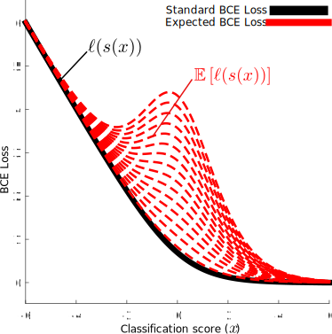

# UA-CNN: Uncertainty-aware CNN

Propagation of Gaussian uncertainty through typical CNN building blocks.

Technical report can be found [here](https://arxiv.org/abs/2102.06064). If you find UA-CNN useful in your research, please consider adding the following citation:

~~~bibtex
@misc{uacnn,
      author = {Christos, Tzelepis and Ioannis, Patras},
      title = {{UA-CNN}: Uncertainty Propagation in Convolutional NeuralNetworks},
      year = {2020},
      publisher = {GitHub},
      journal = {GitHub repository},
      howpublished = {\url{https://github.com/chi0tzp/uacnn}},
}
~~~

- **UAConv2d**: Uncertainty-aware 2D convolution

  

- **UAAvgPool2d**: Uncertainty-aware 2D pooling

  

- **UALinear**: Uncertainty-aware linear (fully-connected) layer

  

- **UAReLU**: Uncertainty-aware rectified linear unit for various amounts of input uncertainty

  

- Expected BCE loss (**UABCELoss**) for various amounts of input uncertainty (dashed red lines) compared to standard BCE loss

  
