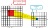
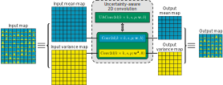
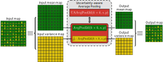
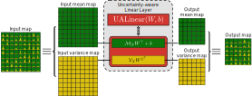

# UA-CNN: Uncertainty-aware CNN

Propagation of Gaussian uncertainty through typical CNN building blocks.

- **UAConv2d**: Uncertainty-aware 2D convolution

  

- **UAAvgPool2d**: Uncertainty-aware 2D pooling

  

- **UALinear**: Uncertainty-aware linear (fully-connected) layer

  

- **UAReLU**: Uncertainty-aware rectified linear unit

